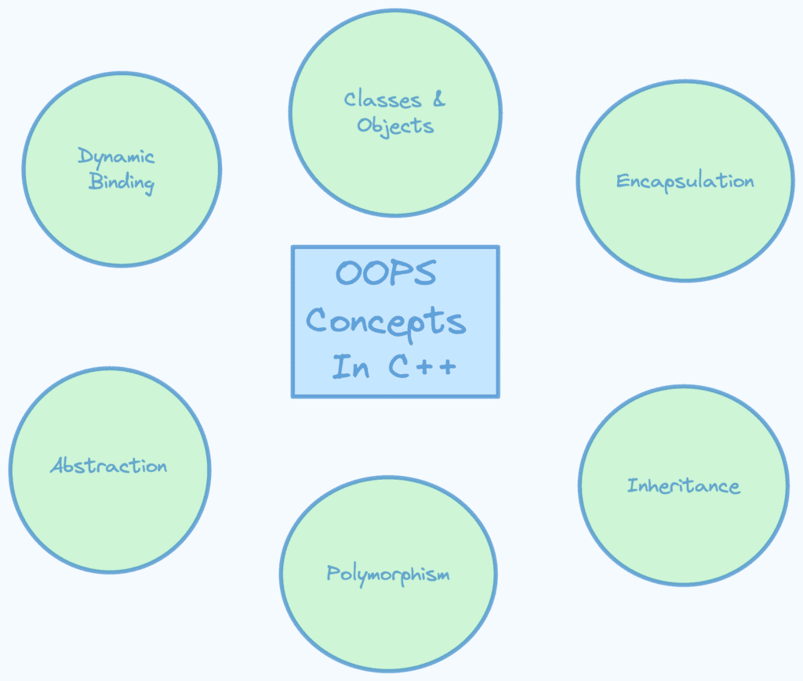
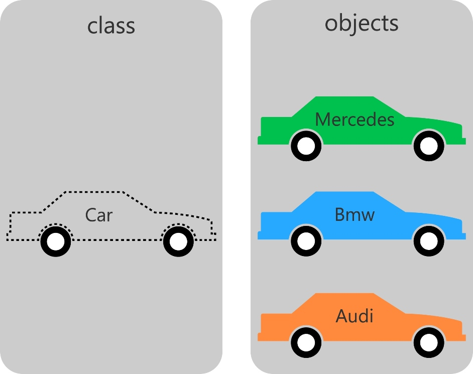

1. **Class**: A blueprint for creating objects, defining a set of attributes and methods that the objects created from the class will have.

2. **Object**: An instance of a class that contains actual values for the attributes defined by the class and can perform the methods defined by the class.

3. **Abstraction**: The concept of hiding complex implementation details and showing only the necessary features of an object.

4. **Encapsulation**: The bundling of data (attributes) and methods (functions) that operate on the data into a single unit or class, often with access restrictions to protect the data.

5. **Inheritance**: A mechanism where a new class (child) derives properties and behavior (methods) from an existing class (parent), promoting code reuse.

6. **Polymorphism**: The ability of different objects to respond to the same method in different ways, typically through method overriding (runtime polymorphism) or method overloading (compile-time polymorphism).