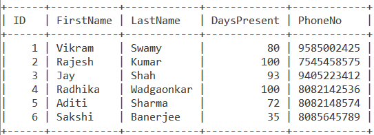
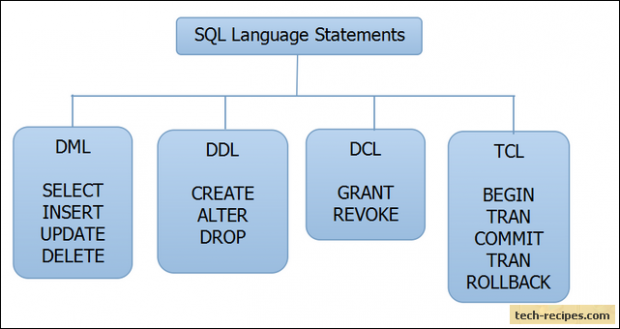

# sql
## sql is a computer language which is used to store manipulate and retrieving data in relational database 

# ex

# Sub languages


# DDL

Certainly! Below are examples of data definition in SQL using a `students` table as a primary example. This will include the `CREATE`, `ALTER`, `DROP`, `TRUNCATE`, and `RENAME` commands, along with some additional constraints and indexing examples.

### 1. CREATE
#### Syntax
```sql
CREATE TABLE table_name (
    column1 datatype constraints,
    column2 datatype constraints,
    ...
);
```

#### Example
Creating a `students` table with various columns and constraints.
```sql
CREATE TABLE students (
    student_id INT PRIMARY KEY,
    first_name VARCHAR(50) NOT NULL,
    last_name VARCHAR(50) NOT NULL,
    date_of_birth DATE,
    enrollment_date DATE,
    gpa DECIMAL(3, 2) CHECK (gpa >= 0.0 AND gpa <= 4.0),
    email VARCHAR(100) UNIQUE
);
```

### 2. ALTER
#### Syntax
```sql
ALTER TABLE table_name 
ADD column_name datatype constraints;

ALTER TABLE table_name 
DROP COLUMN column_name;

ALTER TABLE table_name 
MODIFY COLUMN column_name datatype constraints;
```

#### Example
Adding a column `phone_number`, dropping the `email` column, and modifying the `gpa` column.
```sql
ALTER TABLE students ADD COLUMN phone_number VARCHAR(15);

ALTER TABLE students DROP COLUMN email;

ALTER TABLE students MODIFY COLUMN gpa DECIMAL(4, 3);
```

### 3. DROP
#### Syntax
```sql
DROP TABLE table_name;
```

#### Example
Dropping the `students` table.
```sql
DROP TABLE students;
```

### 4. TRUNCATE
#### Syntax
```sql
TRUNCATE TABLE table_name;
```

#### Example
Removing all rows from the `students` table without deleting the table itself.
```sql
TRUNCATE TABLE students;
```

### 5. RENAME
#### Syntax
```sql
RENAME TABLE old_table_name TO new_table_name;
```

#### Example
Renaming the `students` table to `university_students`.
```sql
RENAME TABLE students TO university_students;
```

### Additional Constraints and Indexing

#### Creating a Table with Foreign Key Constraint
Creating a `courses` table and a `student_courses` table that references `students` and `courses`.
```sql
CREATE TABLE courses (
    course_id INT PRIMARY KEY,
    course_name VARCHAR(100) NOT NULL
);

CREATE TABLE student_courses (
    student_id INT,
    course_id INT,
    grade CHAR(1),
    PRIMARY KEY (student_id, course_id),
    FOREIGN KEY (student_id) REFERENCES students(student_id),
    FOREIGN KEY (course_id) REFERENCES courses(course_id)
);
```

#### Adding an Index
Creating an index on the `last_name` column of the `students` table.
```sql
CREATE INDEX idx_students_lastname ON students (last_name);
```

### Comprehensive Example
Creating the `students` table with constraints and then modifying it.
```sql
-- Creating the table
CREATE TABLE students (
    student_id INT PRIMARY KEY,
    first_name VARCHAR(50) NOT NULL,
    last_name VARCHAR(50) NOT NULL,
    date_of_birth DATE,
    enrollment_date DATE,
    gpa DECIMAL(3, 2) CHECK (gpa >= 0.0 AND gpa <= 4.0),
    email VARCHAR(100) UNIQUE
);

-- Altering the table
ALTER TABLE students ADD COLUMN phone_number VARCHAR(15);
ALTER TABLE students DROP COLUMN email;
ALTER TABLE students MODIFY COLUMN gpa DECIMAL(4, 3);

-- Creating an index
CREATE INDEX idx_students_lastname ON students (last_name);

-- Creating related tables
CREATE TABLE courses (
    course_id INT PRIMARY KEY,
    course_name VARCHAR(100) NOT NULL
);

CREATE TABLE student_courses (
    student_id INT,
    course_id INT,
    grade CHAR(1),
    PRIMARY KEY (student_id, course_id),
    FOREIGN KEY (student_id) REFERENCES students(student_id),
    FOREIGN KEY (course_id) REFERENCES courses(course_id)
);
```

By following these examples, you can define, modify, and manage a `students` table and related tables within a database, ensuring the structure and integrity of your data.