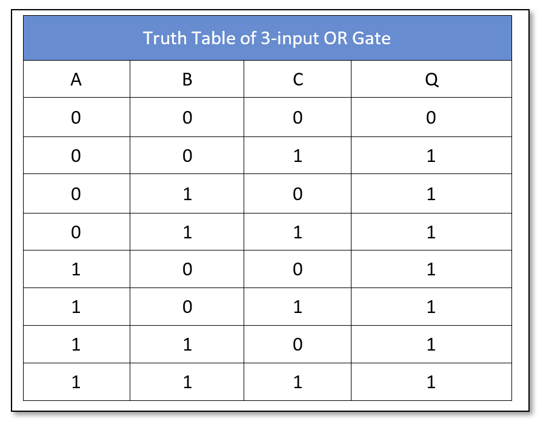
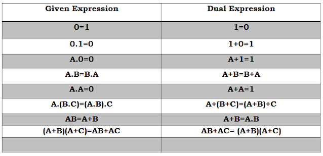
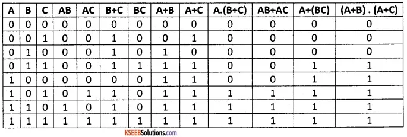
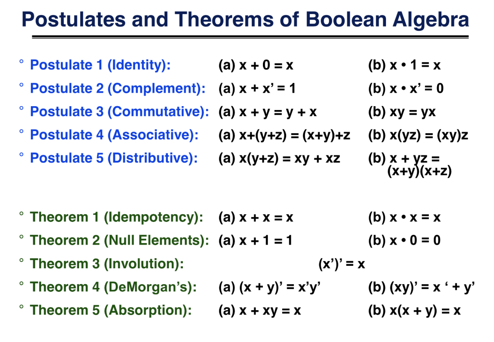
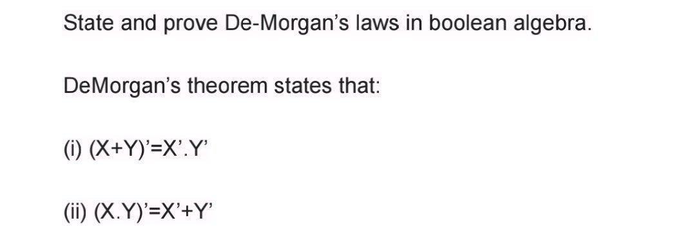

Boolean algebra is a branch of algebra that deals with true or false values, typically represented as 1 (true) and 0 (false). It's foundational for digital logic and computer science, involving operations like AND, OR, NOT, and XOR. Let's cover the basic operations:

it is also know as <b>switching algebra</b>

True -->   1
False ---> 0

# Logical operatios

# and ---> *
# or ---> +

### Tautology 
### Fallacy 

# OR 3 input

# AND 3 input

# venn diagram

# principle of Duality

## The principle of duality in Boolean algebra states that every valid Boolean expression remains valid if all AND (∧) and OR (∨) operators are interchanged, and all identity elements 0 and 1 are swapped. This means that for any Boolean expression, its dual (obtained by these substitutions) will also be a valid Boolean expression.

# true table 

# Boolean theorms

# DeMorgan therom

