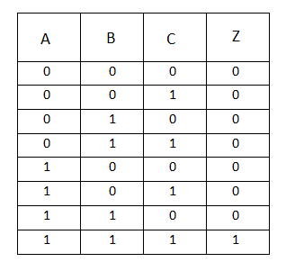

Boolean algebra is a branch of algebra that deals with true or false values, typically represented as 1 (true) and 0 (false). It's foundational for digital logic and computer science, involving operations like AND, OR, NOT, and XOR. Let's cover the basic operations:

it is also know as <b>switching algebra</b>

True -->   1
False ---> 0

# Logical operatios

and ---> *
or ---> +

### Tautology 
### Fallacy 

# OR 3 input

# AND 3 input

# venn diagram

